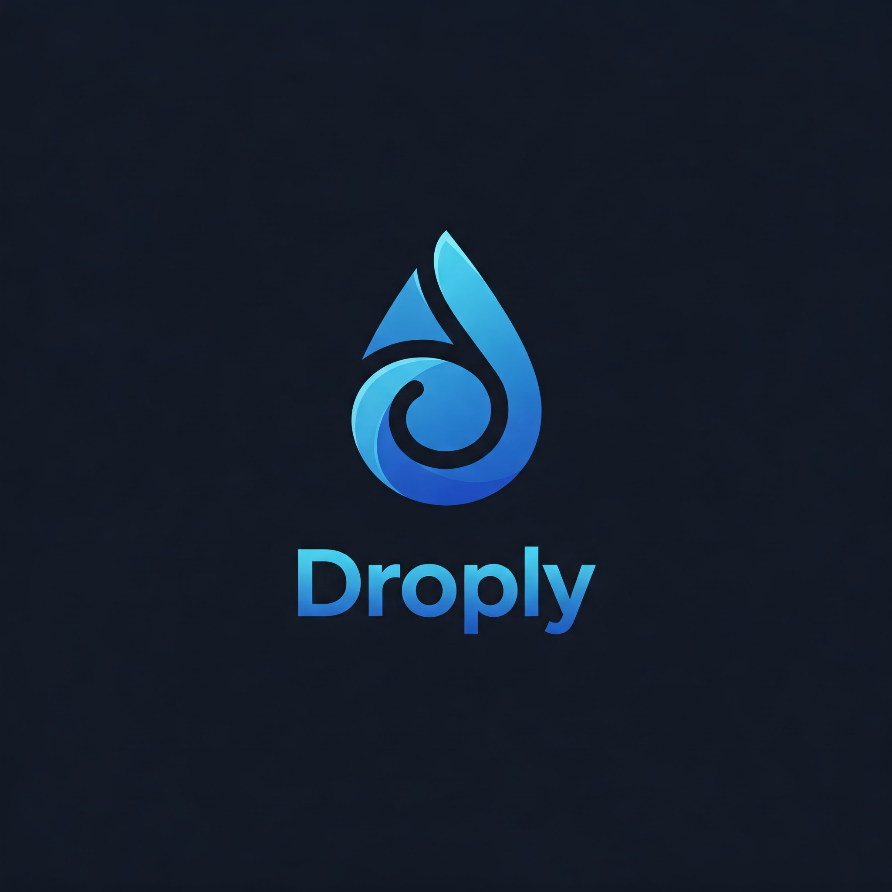

# 📁 Droply

[](https://nextjs.org/)
[](https://www.typescriptlang.org/)
[](https://neon.tech)
[](https://clerk.dev/)
[](https://imagekit.io/)
[](https://redis.com/)
[](https://orm.drizzle.team/)
[](https://tailwindcss.com/)
[](LICENSE)
[](CONTRIBUTING.md)


[](https://huggingface.co/Sakshamgoel107/your-model)
[](https://gemini.google.com/)


A modern, secure, and user-friendly file storage application that allows you to manage your files in the cloud with ease. Built with cutting-edge technologies for optimal performance and security.

## ✨ Key Features

- 🔐 **Secure Authentication**
  - Powered by Clerk for enterprise-grade security
  - Social login support
  - Password recovery and reset functionality
  
- 📤 **Advanced File Management**
  - Fast and reliable file uploads via ImageKit CDN
  - Organize files with intuitive folder structure
  - Star important files for quick access
  - Trash bin for safe file deletion
  - Bulk file operations support
  
- 🔗 **File Sharing**
  - Generate secure sharing links
  - Control access permissions
  - Password protection for shared files
  
- 💻 **Modern User Experience**
  - Responsive design that works on all devices
  - Beautiful and intuitive UI with HeroUI
  - Dark/Light mode support
  - Drag-and-drop file uploads
  - Real-time upload progress
  - Ai image Generation

## 🛠️ Tech Stack

- 🎯 **Frontend**: [Next.js](https://nextjs.org/) 14 with App Router & [HeroUI](https://heroui.com/)
- 🔒 **Authentication**: [Clerk](https://clerk.dev/) - Modern auth & user management
- 💾 **Database**: [Neon](https://neon.tech/) (Serverless PostgreSQL)
- 🗄️ **ORM**: [Drizzle](https://orm.drizzle.team/) - Type-safe database queries
- 📊 **File Storage**: [ImageKit](https://imagekit.io/) - Optimized media delivery & CDN

## 🚀 Getting Started

### 📋 Prerequisites

- 📦 Node.js 18+ and npm/yarn/pnpm
- 🔑 [Clerk](https://clerk.dev/) account for authentication
- 🗃️ [Neon](https://neon.tech/) PostgreSQL database instance
- 📸 [ImageKit](https://imagekit.io/) account for file storage

### ⚙️ Installation

1. Clone the repository:

   ```bash
   git clone https://github.com/Saksham-goel1107/Droply.git
   cd Droply
   ```

2. Install dependencies:

   ```bash
   npm install
   # or
   yarn install
   # or
   pnpm install
   ```

3. Create a `.env.local` file in the root directory with the following environment variables:

   ```
   # Clerk Authentication
   NEXT_PUBLIC_CLERK_PUBLISHABLE_KEY=your_clerk_publishable_key
   CLERK_SECRET_KEY=your_clerk_secret_key

   # ImageKit
   NEXT_PUBLIC_IMAGEKIT_PUBLIC_KEY=your_imagekit_public_key
   IMAGEKIT_PRIVATE_KEY=your_imagekit_private_key
   NEXT_PUBLIC_IMAGEKIT_URL_ENDPOINT=your_imagekit_url_endpoint

   # Clerk URLs
   NEXT_PUBLIC_CLERK_SIGN_IN_URL=/sign-in
   NEXT_PUBLIC_CLERK_SIGN_UP_URL=/sign-up
   NEXT_PUBLIC_CLERK_AFTER_SIGN_IN_URL=/dashboard
   NEXT_PUBLIC_CLERK_AFTER_SIGN_UP_URL=/dashboard

   # Fallback URLs
   NEXT_PUBLIC_CLERK_SIGN_IN_FALLBACK_REDIRECT_URL=/
   NEXT_PUBLIC_CLERK_SIGN_UP_FALLBACK_REDIRECT_URL=/

   # App URLs
   NEXT_PUBLIC_APP_URL=http://localhost:3000

   # Database - Neon PostgreSQL
   DATABASE_URL=your_neon_database_url
   
   # Gemini api Keys
   GEMINI_API_KEY=your_gemini_api

   # Hugging Face API Key for Image Generation
   HUGGINGFACE_API_KEY=your_huggingface_api_key

   # Redis Setup
   REDIS_URL=your_redis_url
   REDIS_USERNAME=your_redis_username
   REDIS_PASSWORD=your_redis_passowrd
   ```

4. Set up your accounts and get the required API keys:
   - Create a [Clerk](https://clerk.dev/) account and get your API keys
   - Create a [Neon](https://neon.tech/) PostgreSQL database and get your connection string
   - Create an [ImageKit](https://imagekit.io/) account and get your API keys

### 🏃 Running the Application

1. Start the development server:

   ```bash
   npm run dev
   # or
   yarn dev
   # or
   pnpm dev
   ```

2. 🌐 Open [http://localhost:3000](http://localhost:3000) in your browser to access Droply.

   You should see the landing page with options to sign in or create a new account.

### 🏗️ Building for Production

1. Build the application:

   ```bash
   npm run build
   # or
   yarn build
   # or
   pnpm build
   ```

2. Start the production server:
   ```bash
   npm start
   # or
   yarn start
   # or
   pnpm start
   ```

## 📁 Project Structure

```
├── app/                  # Next.js app router pages
│   ├── api/             # API routes
│   ├── dashboard/       # User dashboard
│   └── ...             # Other pages
├── components/          # React components
│   ├── ui/             # Reusable UI components
│   └── ...             # Feature components
├── lib/                # Core utilities
│   └── db/            # Database configuration
├── public/             # Static assets
└── types/              # TypeScript type definitions
```

## 🤝 Contributing

Contributions are welcome! Here's how you can help:

1. 🍴 Fork the repository
2. 🌿 Create a new branch (`git checkout -b feature/improvement`)
3. 🔄 Make your changes
4. ✅ Commit your changes (`git commit -am 'Add new feature'`)
5. 📤 Push to the branch (`git push origin feature/improvement`)
6. 🎯 Open a Pull Request

## 📝 License

This project is licensed under the MIT License - see the [LICENSE](LICENSE) file for details.

## 💫 Support

If you find this project helpful, please consider giving it a ⭐️ on GitHub!
